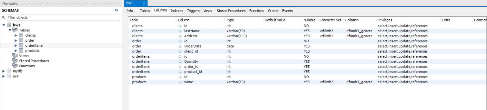

# Relation database (HW1)

## Content

- [Objectives](#objectives)
- [1NF](#1NF)
- [2NF](#2NF)
- [3NF](#3NF)
- [Database Schemas](#database-schemas)

## Objectives
1. Convert the initial table to the first normal form.

2. Convert the new tables to the second normal form.

3. Convert the new tables to the third normal form.

4. Develop an ER diagram for the resulting tables.

5. Using the ER diagram, create the tables in the database. Design these tables without specific values, taking into account only the columns and their relationships, either manually or automatically.

| OrderNumber | ProductName and Quantity                | ClientAddress  | OrderDate   | Client   |
|-------------|-----------------------------------------|----------------|-------------|----------|
| 101         | Лептоп: 3, Мишка: 2                     | Хрещатик 1     | 2023-03-15  | Мельник  |
| 102         | Принтер: 1                              | Басейна 2      | 2023-03-16  | Шевченко |
| 103         | Мишка: 4                                | Комп'ютерна 3  | 2023-03-17  | Коваленко|

## 1NF
Let's transform the basic table into the first normal form.
| OrderNumber | ProductName | Quantity | ClientAddress  | OrderDate   | Client   |
|-------------|-------------|----------|----------------|-------------|----------|
| 101         | Лептоп      | 3        | Хрещатик 1     | 2023-03-15  | Мельник  |
| 101         | Мишка       | 2        | Хрещатик 1     | 2023-03-15  | Мельник  |
| 102         | Принтер     | 1        | Басейна 2      | 2023-03-16  | Шевченко |
| 103         | Мишка       | 4        | Комп'ютерна 3  | 2023-03-17  | Коваленко|

Accordingly, the ER diagram for 1NF looks like this

## 2NF
Next step is transform table from 1NF to 2NF.  To obtain 2NF, we need to divide the original 1NF table into 2 tables - Orders and OrderItems
### Orders

| OrderNumber (PK)  | OrderDate  | ClientAddress  | Client     |
|-------------------|------------|----------------|------------|
| 101               | 2023-03-15 | Хрещатик 1     | Мельник    |
| 102               | 2023-03-16 | Басейна 2      | Шевченко   |
| 103               | 2023-03-17 | Комп'ютерна 3  | Коваленко  |

### OrderItems

| id (PK) | OrderNumber | ProductName | Quantity |
|---------|-------------|-------------|----------|
| 1       | 101         | Лептоп      | 3        |
| 2       | 101         | Мишка       | 2        |
| 3       | 102         | Принтер     | 1        |
| 4       | 103         | Мишка       | 4        |

Accordingly, the ER diagram for 2NF looks like this

## 3NF
To obtain 3NF, it is necessary to divide the 2NF tables.

### Orders

| OrderNumber (PK)  | OrderDate  | clientID |
|-------------------|------------|----------|
| 101               | 2023-03-15 | 1        |
| 102               | 2023-03-16 | 2        |
| 103               | 2023-03-17 | 3        |

### OrderItems

| id (PK) | OrderNumber | ProductName | Quantity |
|---------|-------------|-------------|----------|
| 1       | 101         | 1           | 3        |
| 2       | 101         | 2           | 2        |
| 3       | 102         | 3           | 1        |
| 4       | 103         | 2           | 4        |

### Clients

| id (PK) | Client      | ClientAddress    |
|---------|-------------|------------------|
| 1       | Мельник     | Хрещатик 1       |
| 2       | Шевченко    | Басейна 2        |
| 3       | Коваленко   | Комп'ютерна 3    |

### Products

| id (PK) | ProductName |
|---------|-------------|
| 1       | Лептоп      |
| 2       | Мишка       |
| 3       | Принтер     |

Accordingly, the ER diagram for 3NF looks like this

## Database Schemas

According to 3NF, a database and tables were built using [SQL queries](queries.sql).

### Orders Table

### OrdersItems Table

### Client Table

### Product Table

The final structure of tables and columns looks like this

### Database schemas